# Part 1
Install Ubuntu & run `cat /etc/issue`

<p align="center" width="100%">
    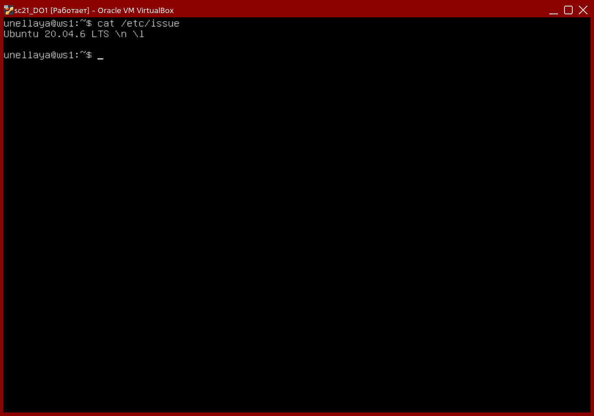
</p>

# Part 2
Add new user `new` to group `adm`

```console
sudo useradd -G adm new
```

<p align="center" width="100%">
    
</p>

# Part 3
Change machine name to `user-1`

```console
sudo hostnamectl set-hostname user-1
sudo reboot
```

Change machine timezone to your local

```console
sudo timedatectl set-timezone Europe/Moscow
```

<p align="center" width="100%">
    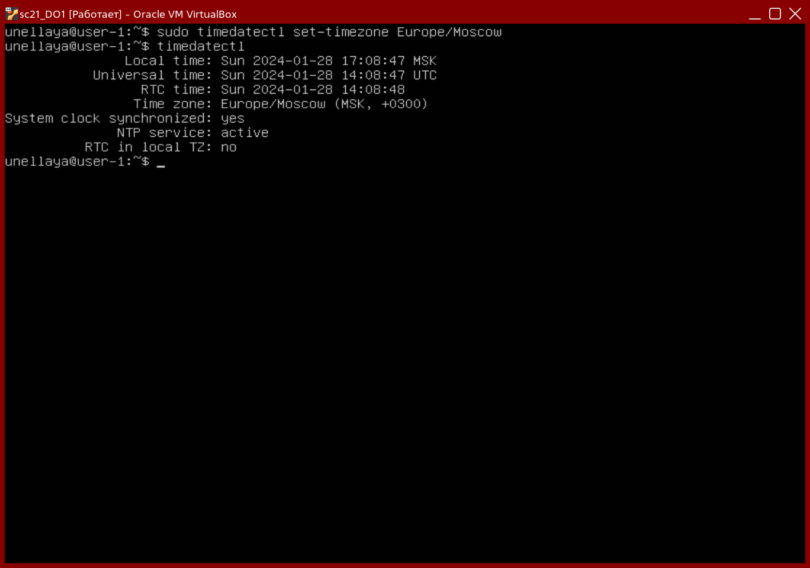
</p>

List machine network interfaces  

> `lo` interface - the loopback device is a special, virtual network interface that your computer uses to communicate with itself. It is used mainly for diagnostics and troubleshooting, and to connect to servers running on the local machine.
[[Link]](https://askubuntu.com/questions/247625/what-is-the-loopback-device-and-how-do-i-use-it)

```console
tcpdump --list-interfaces
```

<p align="center" width="100%">
    
</p>

Get your ip address

> A DHCP Server is a network server that automatically provides and assigns IP addresses, default gateways and other network parameters to client devices. It relies on the standard protocol known as Dynamic Host Configuration Protocol or DHCP to respond to broadcast queries by clients.
[[Link]](https://www.infoblox.com/glossary/dhcp-server/)

```console
ipconfig -a
```

<p align="center" width="100%">
    
</p>

Get gateway external and internal ip addresses

```console
curl -s http://whatismyip.akamai.com/
ip route | grep default
```

<p align="center" width="100%">
    
</p>

Set custom ip, gw, dns settings

```console
sudo vim /etc/netplan/00-installer-config.yaml
sudo netplan apply
```

<p align="center" width="100%">
    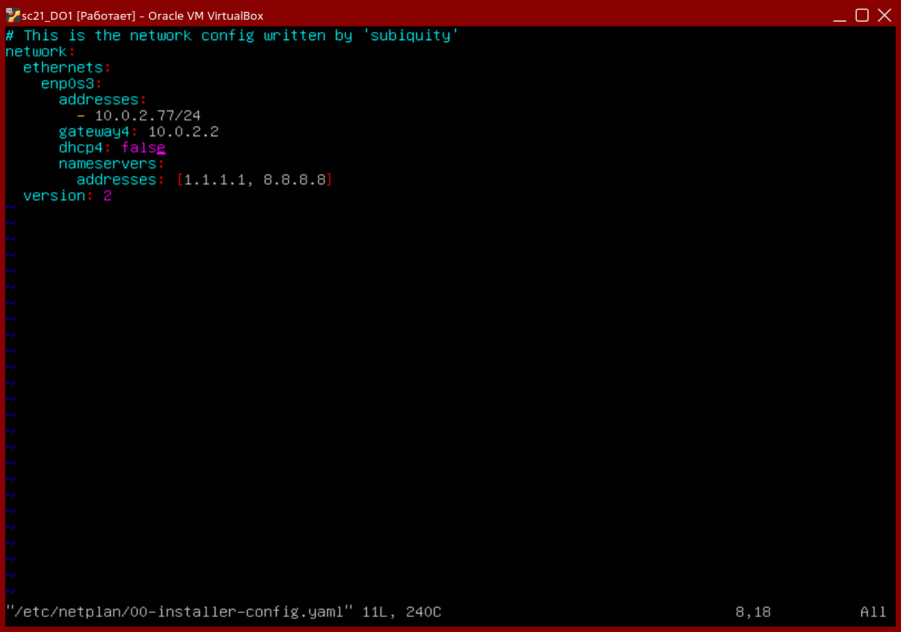
</p>

```console
sudo reboot
ifconfig -a
```

<p align="center" width="100%">
    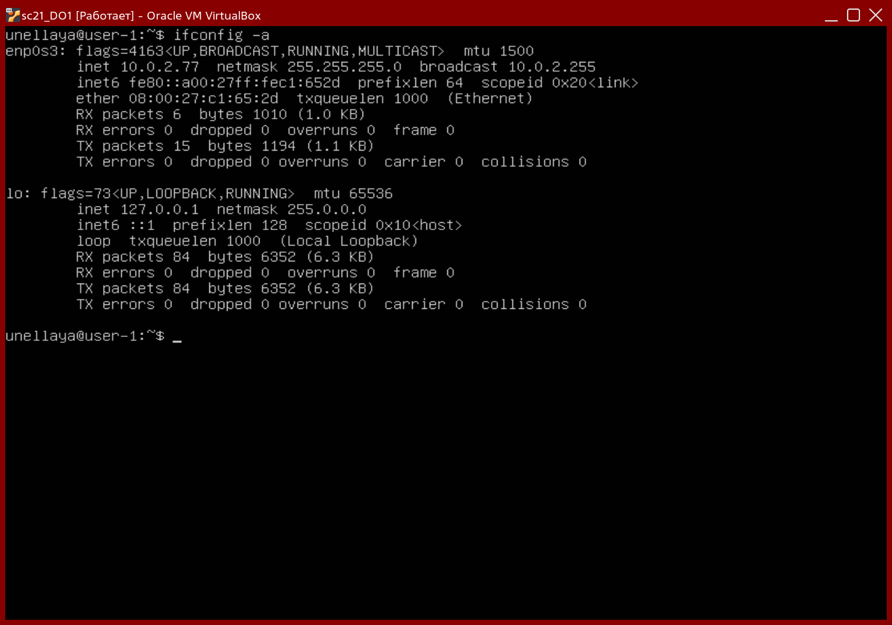
</p>

Ping 1.1.1.1 & ya.ru

```console
ping -c 1 1.1.1.1
ping -c 1 ya.ru
```

<p align="center" width="100%">
    
</p>

# Part 4
Update system packets

```console
sudo apt update
sudo apt full-uprade
```

<p align="center" width="100%">
    
</p>

> Sudo gives us safe elevated privileges when we want to run important commands. It might be THE most used and powerful command among Ubuntu users, as it has become the preferred method in that distribution. Now that you have the power, be sure to be safe when you issue your commands
[[Link]](https://www.pluralsight.com/resources/blog/cloud/linux-commands-for-beginners-sudo)

Change machine name from user `new` using `sudo`

```console
sudo usermod -a -G sudo new
sudo su new
sudo hostnamectl set-hostname user-2
cat /etc/hostname
```

<p align="center" width="100%">
    
</p>

# Part 6
Get you local timezone time

```console
sudo apt install systemd-timesyncd
sudo timedatectl set-ntp on
date
timedatectl show
```

<p align="center" width="100%">
    
</p>

# Part 7
Install VIM, NANO, mcedit
```console
sudo apt update
sudo apt install mcedit
sudo apt install vim
sudo apt install nano
```
## Task 1
Use vim, nano, mcedit to create `test_{EDITOR_NAME}.txt` files and input there your nickname then exit with save
### VIM
```console
vim test_vim.txt
Press "I"
Input "unellaya"
Press "Esc" and input ":wq" & press "Enter"
```

<p align="center" width="100%">
    
</p>

### NANO
```console
nano test_nano.txt
Input "unellaya"
Press "Ctrl+X" and input "Y" & press "Enter"
```

<p align="center" width="100%">
    
</p>

### MCEDIT
```console
nano test_mcedit.txt
Input "unellaya"
Press "Esc" & Press "Yes"
```

<p align="center" width="100%">
    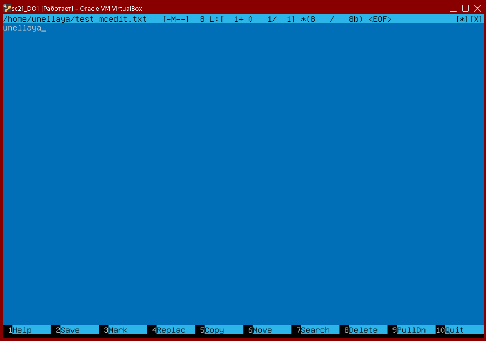
</p>

## Task 2
Use vim, nano, mcedit to open those files, edit your nickname to `21 School 21` and close file withour save

### VIM
```console
vim test_vim.txt
Press "I"
Change "unellaya" to "21 School 21"
Press "Esc" and input ":q!" & press "Enter"
```
<p align="center" width="100%">
    
</p>

### NANO
```console
vim test_nano.txt
Change "unellaya" to "21 School 21"
Press "Ctrl+X" and input "N" & press "Enter"
```
<p align="center" width="100%">
    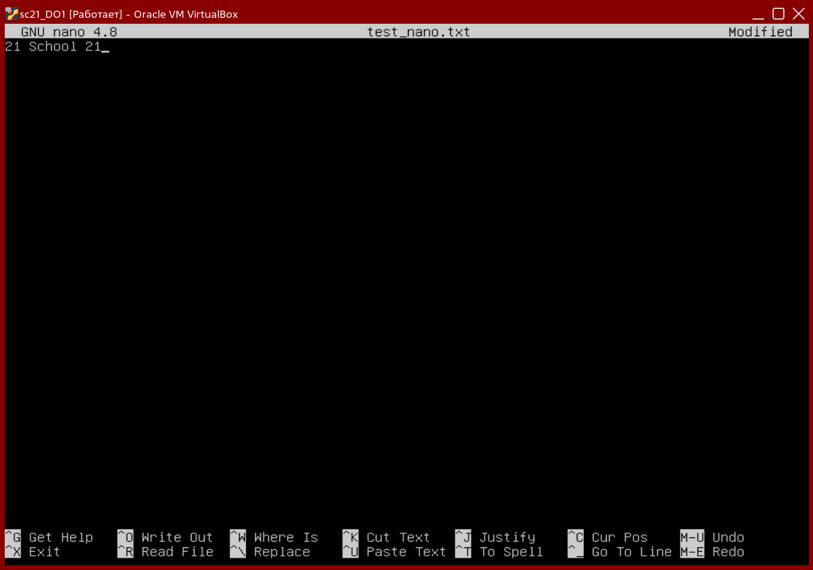
</p>

### MCEDIT
```console
nano test_mcedit.txt
Change "unellaya" to "21 School 21"
Press "Esc" & Press "No"
```

<p align="center" width="100%">
    
</p>

## Task 3
Use vim, nano, mcedit to search & replace strings

### VIM
```console
vim test_vim.txt
Input "/unellaya" to search string
Input ":%s/unellaya/21 School 21" to  replace it
```

<p align="center" width="100%">
    <div style="display: flex">
        
        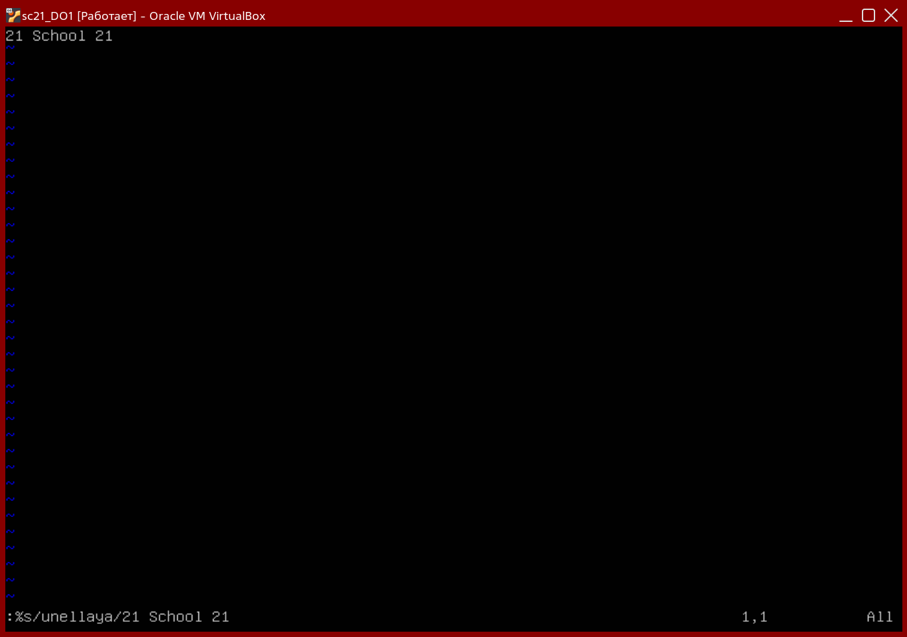
    </div>
</p>

### NANO
```console
nano test_nano.txt
Press "Ctrl+W" & input "unellaya" to search string
Press "Ctrl+\" and input "unellaya" & press "Enter"
then input "21 School 21" & press "Enter" and press "Y" to replace string
```

<p align="center" width="100%">
    <div style="display: flex">
        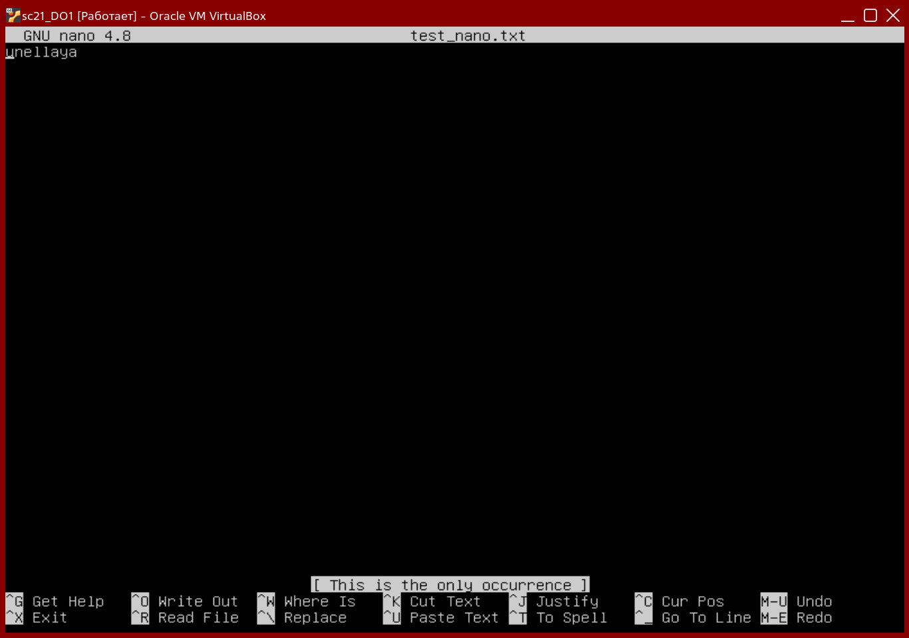
        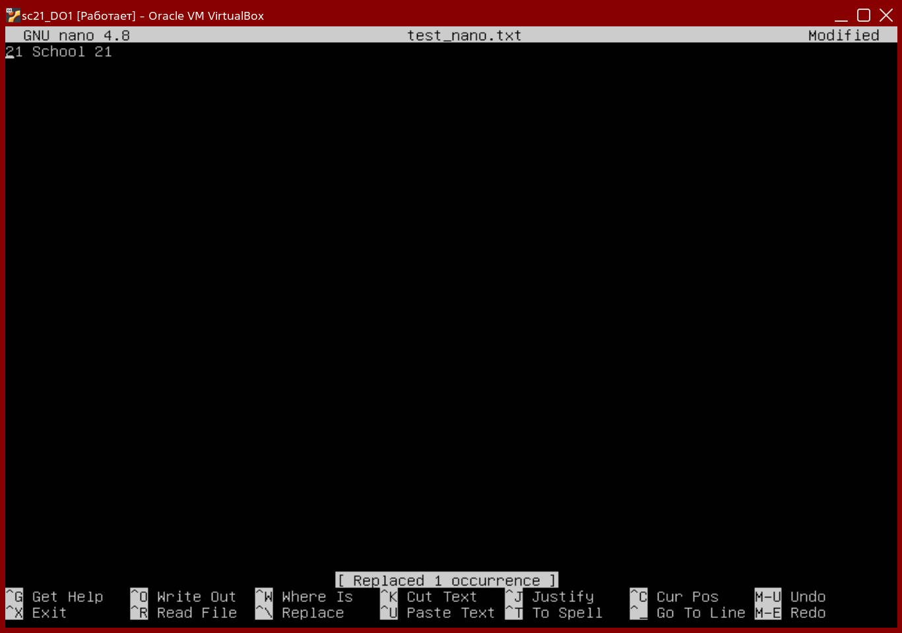
    </div>
</p>

### MCEDIT
```console
mcedit test_mcedit.txt
Press "F7" & input "unellaya" to search string
Press "F4" and input "unellaya" then press
arrow down and input "21 School 21" & press "Ok"
to replace string
```

<p align="center" width="100%">
    <div style="display: flex">
        
        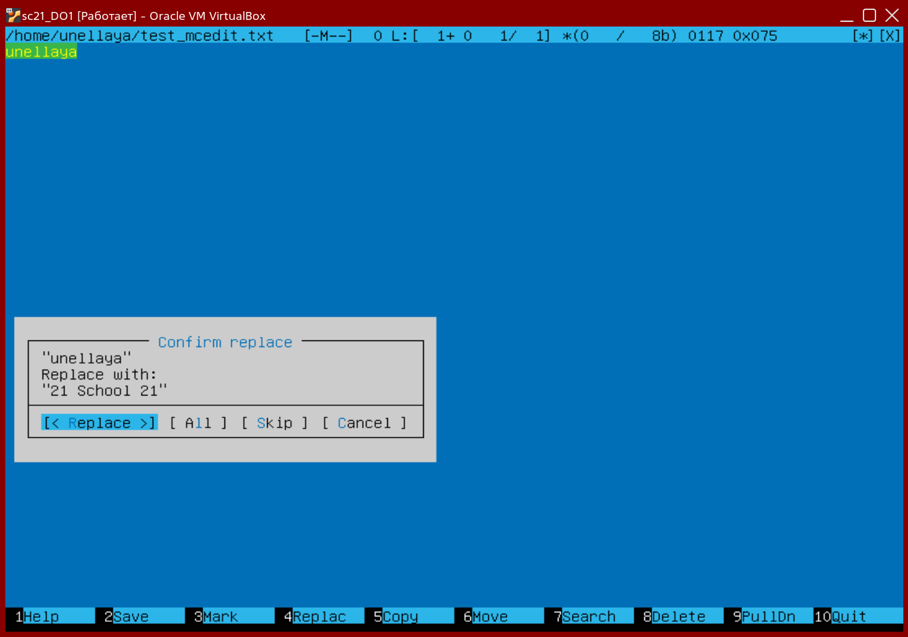
    </div>
</p>

# Part 8
Install SSHd (OpenSSH)

```console
sudo apt install openssh-server
ssh -V
sudo update-rc.d ssh defaults
sudo vim /etc/ssh/sshd_config
Uncomment "#Port 22" and set 2022
/etc/init.d/ssh restart
ps -axfv | grep sshd
```
### PS command & flags description
> `ps` - list all current proccesses  
> flags `a` & `x` - list all processes (when used both)  
> flag `f` - full-format listing  
> flag `v` - display virtual memory format

```console
sudo reboot
sudo apt install net-tools
netstat -tan
```

<p align="center" width="100%">
    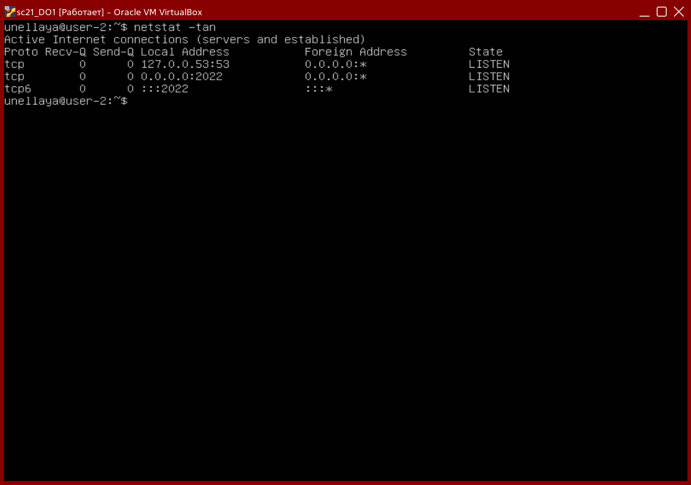
</p>

### Netstat flags & output description

> flag `n` - show numerical addresses instead of trying to determine symbolic host, port or user names  
> flag `a` - show both listening and non-listening sockets  
> flag `t` - filter by TCP protocol

|**Column**|**Description**|
|:-:|:-|
|Proto|Protocol used by the socket|
|Recv-Q|The count of bytes not copied by the user program connected to this socket|
|Send-Q|The count of bytes not acknowledged by the remote host|
|Local Address|Address and port number of the local end of the socket|
|Foreign Address|Address and port number of the remote end of the socket|
|State|The state of socket|

# Part 9
Run and describe `top` & `htop` output
## top
<p align="center" width="100%">
    
</p>

|Parameter|Value|
|:-:|-|
|Uptime|16 min|
|Authorized users|1|
|Average load|0.00|
|Total tasks|92|
|CPU load|`0.3 us, 0.0 sy, 0.0 ni, 99.3 id, 0.3 wa, 0.0 hi, 0.0 si, 0.0 st`|
|Most memory loaded process|1|
|Most proccessor time process|All the same (1)|

## htop
```
htop
Press "F6" and choose column to sort by
Press "F4" and input "SSHd" to filter by it
Press "F3" and input "syslog" to find it
Press "F10" to exit
```

### Sort

<p align="center" width="100%">
    <div style="display: flex">
        
        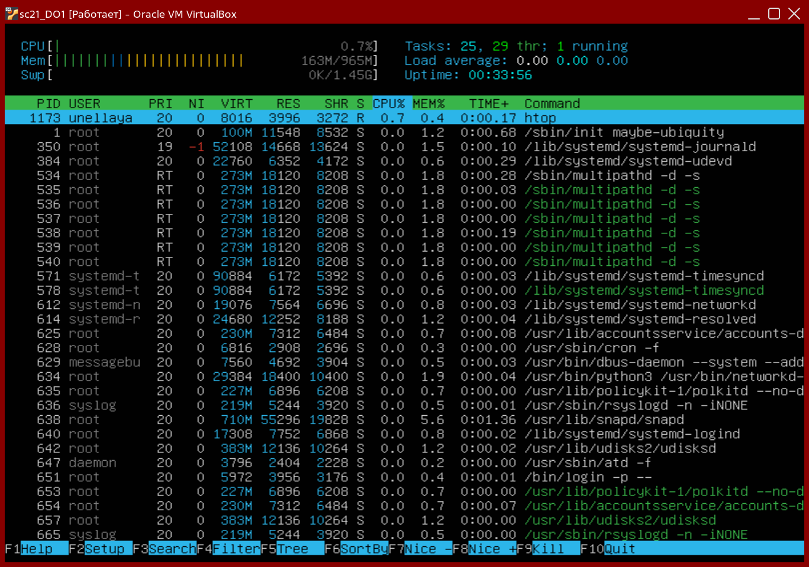
    </div>
    <div style="display: flex">
        
        
    </div>
</p>

### Filter by `SSHd`

<p align="center" width="100%">
    
</p>

### Find `syslog`

<p align="center" width="100%">
    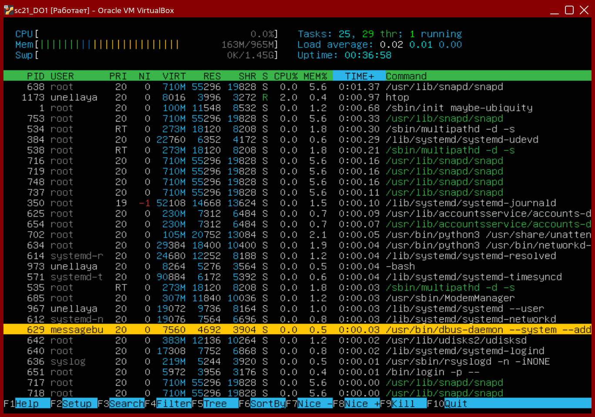
</p>

# Part 10
Run `sudo fdisk -l` and find harddisk name, size, sectors quantity and swap size

<p align="center" width="100%">
    <div style="display: flex">
        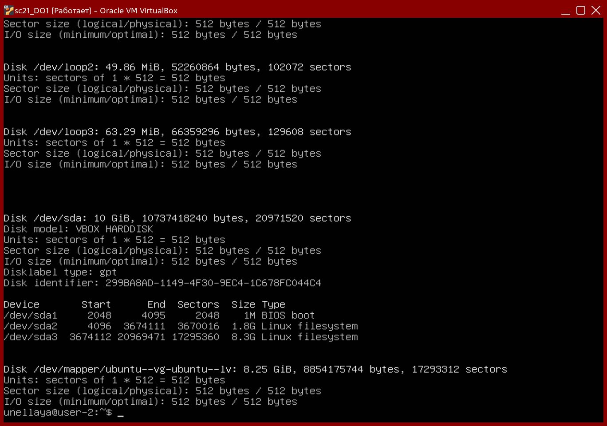
        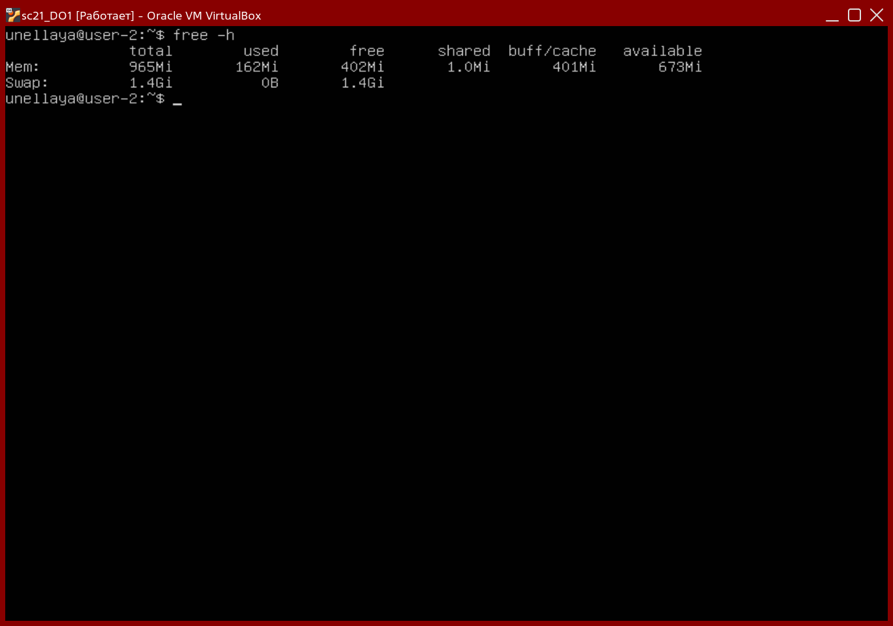
    </div>
</p>

|Parameter|Value|
|:-:|:-|
|HDD Name|VBOX HARDDISK|
|HDD Size|10 GB|
|Sectors|20971520|
|Swap Size|1.4 GB|

# Part 11
## Task 1
Run `df`

<p align="center" width="100%">
    
</p>

|Parameter|Value|
|:-:|:-|
|`/` Size|8408452|
|Used|4237980|
|Free|3721756|
|%|54|
|Measured in|Kb|

## Task 2
Run `df -Th /`

<p align="center" width="100%">
    
</p>

|Parameter|Value|
|:-:|:-|
|`/` Size|8.1 G|
|Used|4.1 G|
|Free|3.6 G|
|%|54|
|Filesystem type|ext4|

# Part 12
Use `du`
```console
du
sudo du -s -h /home && sudo du -s -h /var && sudo du -s -h /var/log
sudo du -sh /var/log/*
```

<p align="center" width="100%">
    <div style="display: flex">
        
        
    </div>
</p>

# Part 13
Install `ncdu` and print sizes of `/home`, `/var`, `/var/log`

```console
sudo apt install ncdu
sudo ncdu /home
sudo ncdu /var
sudo ncdu /var/log
```

<p align="center" width="100%">
    <div style="display: flex">
        
        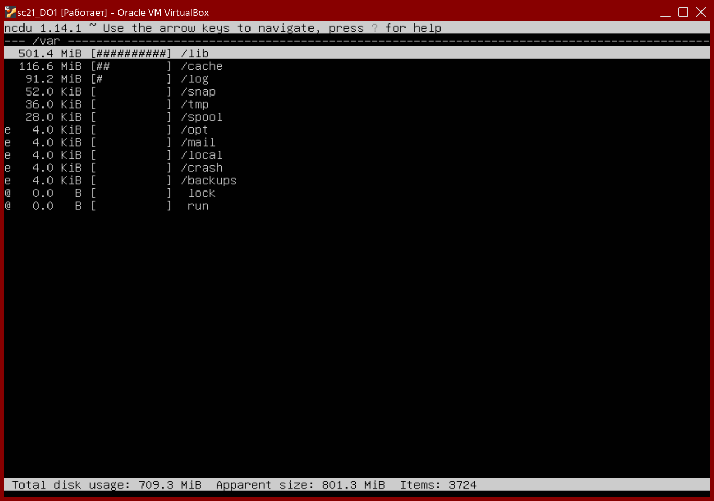
    </div>
    <div style="display: flex">
        
    </div>
</p>

# Part 14
Open `/var/log/dmesg`, `/var/log/syslog`, `/var/log/auth.log`
```console
vim /var/log/dmesg
vim /var/log/syslog
vim /var/log/auth.log
```

<p align="center" width="100%">
    <div style="display: flex">
        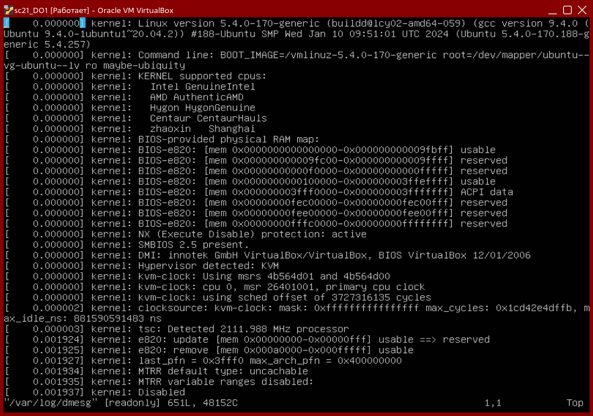
        
    </div>
    <div style="display: flex">
        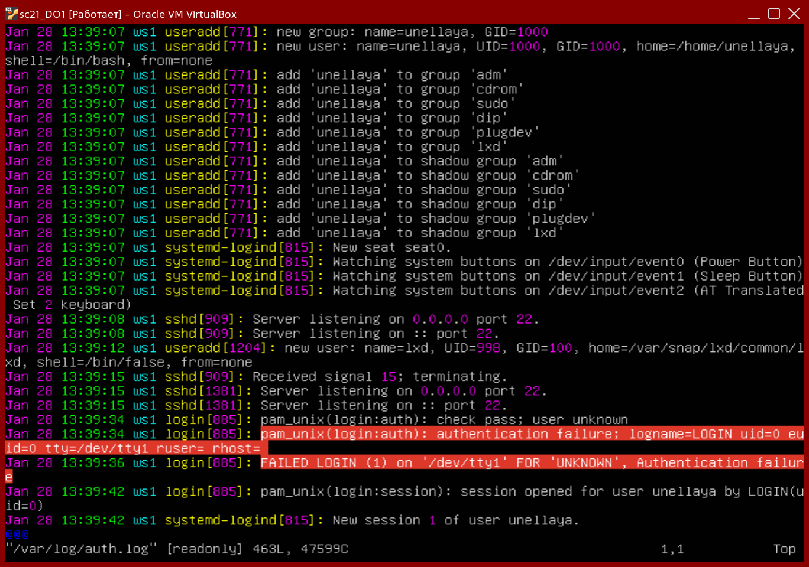
    </div>
</p>

> Check last successfully authorized user, login method:  
> `Jan 28 16:39, unellaya, tty1`

```console
service sshd restart
cudo cat /var/log/syslog
```

<p align="center" width="100%">
    <div style="display: flex">
        
        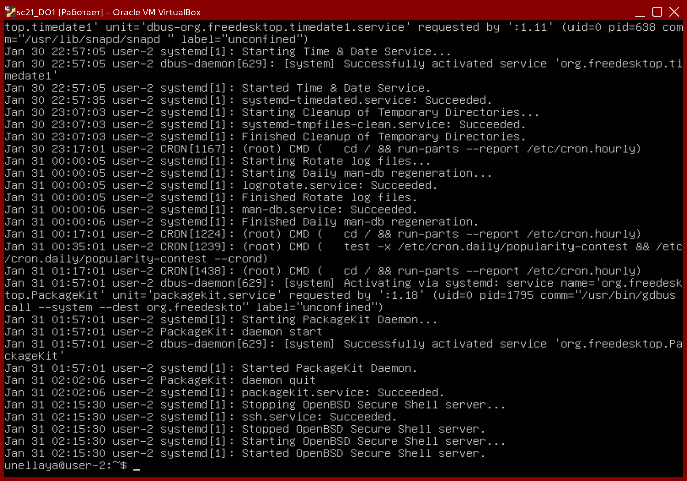
    </div>
</p>

# Part 15
Via task planing manager add `uptime` command to be executed every 2 min. List all planned tasks, check that all works fine,delete task and list all planned tasks (Must be empty)
```console
sudo apt install cron
crontab -e
Append "*/2 * * * * uptime"
crontab -l
sudo grep CRON /var/log/syslog
crontab -r
crontab -l
```

<p align="center" width="100%">
    <div style="display: flex">
        
        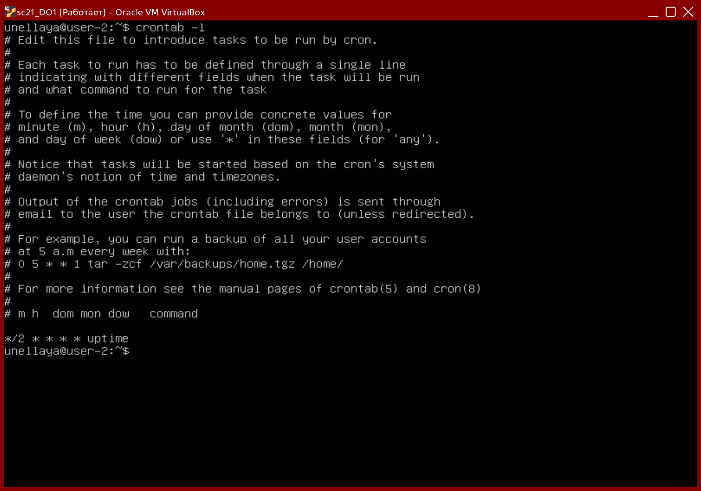
    </div>
    <div style="display: flex">
        
        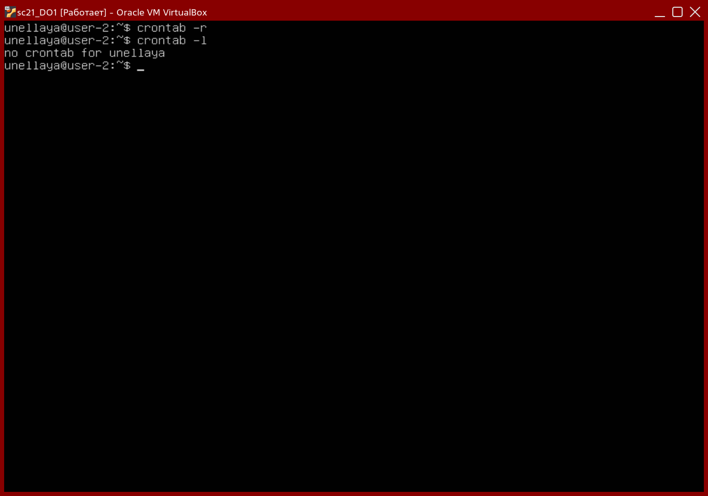
    </div>
</p>
