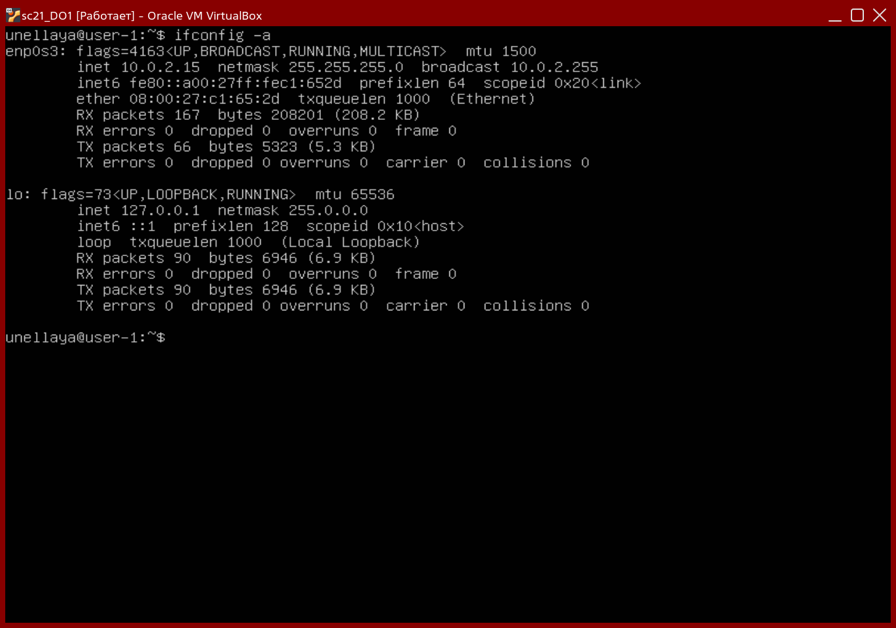
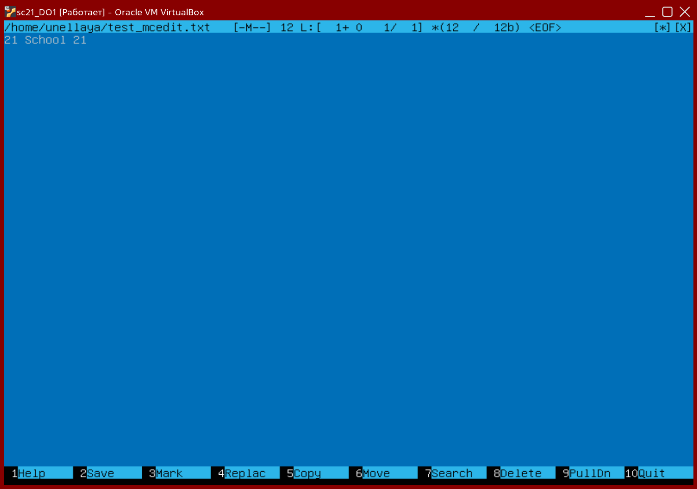
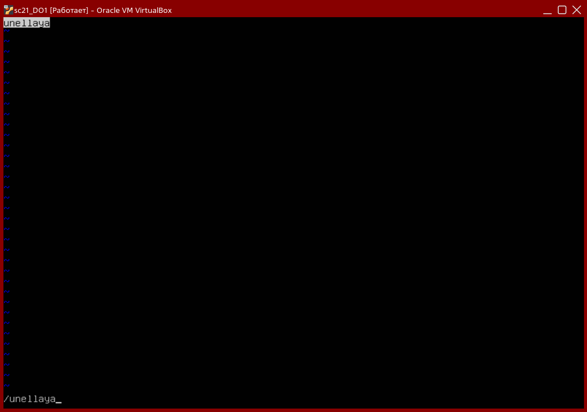
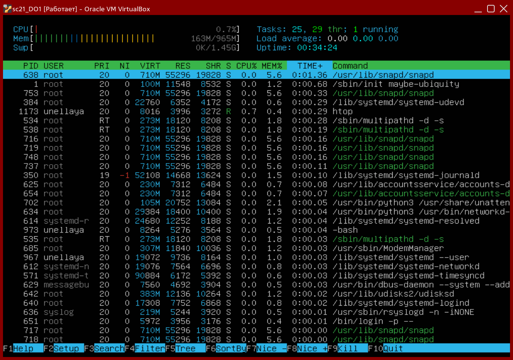

# Part 1
Устанавливаем и запускаем Ubuntu `cat /etc/issue`

<p align="center" width="100%">
    
</p>

# Part 2
Добавляем нового пользователя `new` в группу `adm`

```console
sudo useradd -G adm new
```

<p align="center" width="100%">
    
</p>

# Part 3
Меняем название машины на `user-1`

```console
sudo hostnamectl set-hostname user-1
sudo reboot
```

Меняем временную зону машины на нашу локальную

```console
sudo timedatectl set-timezone Europe/Moscow
```

<p align="center" width="100%">
    
</p>

Перечисляем все сетевые интерфейсы машины  


> `lo` interface - 'the loopback device' это специальный интерфейс витруальный сети, который компьютер использует для взаимодействия с самим собой. В основном используется для диагностики и исправления ошибок, а также для присоединения к серверам, запущенным на локальной машине.
[[Link]](https://askubuntu.com/questions/247625/what-is-the-loopback-device-and-how-do-i-use-it)

```console
tcpdump --list-interfaces
```

<p align="center" width="100%">
    
</p>

Получаем наш ip адрес

> DHCP сервер - это сетевой сервер, который автоматически предоставляет и назначает ip адрес, стандартные gateways и другие параметры сети девайсу клиента. Он опирается на стандартный протокол Dynamic Host Configuration Protocol или DHCP для ответа на широковещательные запросы клиентов.
[[Link]](https://www.infoblox.com/glossary/dhcp-server/)

```console
ipconfig -a
```

<p align="center" width="100%">
    
</p>

Получаем ip адрес external и internal gateway'a
```console
curl -s http://whatismyip.akamai.com/
ip route | grep default
```

<p align="center" width="100%">
    
</p>

Назначаем персонализированные ip, gw, настройки dns
```console
sudo vim /etc/netplan/00-installer-config.yaml
sudo netplan apply
```

<p align="center" width="100%">
    
</p>

```console
sudo reboot
ifconfig -a
```

<p align="center" width="100%">
    
</p>

Пингуем 1.1.1.1 & ya.ru

```console
ping -c 1 1.1.1.1
ping -c 1 ya.ru
```

<p align="center" width="100%">
    
</p>

# Part 4
Обновляем системные пакеты

```console
sudo apt update
sudo apt full-uprade
```

<p align="center" width="100%">
    
</p>

> Sudo дает нам безопасное повышение привелегий когда нам нужно запускать важные команды. Возможно это самая используемся и мощная команда среди всех пользователей Ubuntu, поскольку стала предпочтительным методом в этом дистрибутиве. 
[[Link]](https://www.pluralsight.com/resources/blog/cloud/linux-commands-for-beginners-sudo)

Меняем имя машины от имени пользователя `new` используя `sudo`
```console
sudo usermod -a -G sudo new
sudo su new
sudo hostnamectl set-hostname user-2
cat /etc/hostname
```

<p align="center" width="100%">
    
</p>

# Part 6
Получаем локальную временную зону

```console
sudo apt install systemd-timesyncd
sudo timedatectl set-ntp on
date
timedatectl show
```

<p align="center" width="100%">
    
</p>

# Part 7
Устанавливаем VIM, NANO, mcedit
```console
sudo apt update
sudo apt install mcedit
sudo apt install vim
sudo apt install nano
```
## Task 1
Используем vim, nano, mcedit чтобы создать `test_{EDITOR_NAME}.txt` файлы и ввести туда свой никнейм, дале закрыть и сохранить
### VIM
```console
vim test_vim.txt
Нажимаем "I"
Вводим "unellaya"
Нажимаем "Esc" и вводим ":wq" & нажимаем "Enter"
```

<p align="center" width="100%">
    
</p>

### NANO
```console
nano test_nano.txt
Вводим "unellaya"
Нажимаем "Ctrl+X" и вводим "Y" & нажимаем "Enter"
```

<p align="center" width="100%">
    
</p>

### MCEDIT
```console
nano test_mcedit.txt
Вводим "unellaya"
Нажимаем "Esc" & нажимаем "Yes"
```

<p align="center" width="100%">
    
</p>

## Task 2
Используем vim, nano, mcedit чтобы открыть созданные файлы, изменить наш никнейм на `21 School 21` и закрыть без сохранения

### VIM
```console
vim test_vim.txt
нажимаем "I"
Меняем "unellaya" на "21 School 21"
Нажимаем "Esc" и вводим ":q!" & нажимаем "Enter"
```
<p align="center" width="100%">
    
</p>

### NANO
```console
vim test_nano.txt
Меняем "unellaya" на "21 School 21"
Нажимаем "Ctrl+X" и вводим "N" & нажимаем "Enter"
```
<p align="center" width="100%">
    
</p>

### MCEDIT
```console
nano test_mcedit.txt
Меняем "unellaya" на "21 School 21"
Нажимаем "Esc" & нажимаем "No"
```

<p align="center" width="100%">
    
</p>

## Task 3
Используем vim, nano, mcedit чтообы найти и заменить строки

### VIM
```console
vim test_vim.txt
Вводим "/unellaya" чтобы найти строку
Вводим ":%s/unellaya/21 School 21" чтобы заменить ее
```

<p align="center" width="100%">
    <div style="display: flex">
        
        
    </div>
</p>

### NANO
```console
nano test_nano.txt
Нажимаем "Ctrl+W" & вводим "unellaya" чтобы найти строку
Нажимаем "Ctrl+\" and вводим "unellaya" & нажимаем "Enter"
дальше вводим "21 School 21" & нажимаем "Enter" и нажимаем "Y"  чтобы заменить ее
```

<p align="center" width="100%">
    <div style="display: flex">
        
        
    </div>
</p>

### MCEDIT
```console
mcedit test_mcedit.txt
Нажимаем "F7" & вводим "unellaya" чтобы найти строку
Нажимаем "F4" and вводим "unellaya" далее нажимаем
стрелку вниз и вводим "21 School 21" & нажимаем "Ok"
чтобы заменить ее
```

<p align="center" width="100%">
    <div style="display: flex">
        
        
    </div>
</p>

# Part 8
Устанавливаем SSHd (OpenSSH)

```console
sudo apt install openssh-server
ssh -V
sudo update-rc.d ssh defaults
sudo vim /etc/ssh/sshd_config
Раскоментируем "#Port 22" и задаем порт 2022
/etc/init.d/ssh restart
ps -axfv | grep sshd
```
### PS command & flags description
> `ps` - перечислить все текущие процессы
> флаги `a` & `x` - перечислить ВСЕ процессы (когда используются вместе)  
> флаг `f` - полноформатный вывод  
> флаг `v` - показывать виртуальную память

```console
sudo reboot
sudo apt install net-tools
netstat -tan
```

<p align="center" width="100%">
    
</p>

### Netstat flags & output description

> флаг `n` - показывать численный адрес вместо получения символьного хоста, порта или имени пользователя  
> флаг `a` - показывать слушающие и не слушающие сокеты    
> флаг `t` - фильтровать по протоколу TCP

|**Столбец**|**Описание**|
|:-:|:-|
|Proto|Протокол используемый сокетом|
|Recv-Q|Количество байтов не скопированный программой пользователя подключенной к этому сокету|
|Send-Q|Количество байтов не признанных удаленным хостом|
|Local Address|Адрес и порт локального сокета|
|Foreign Address|Адрес и порт удаленного сокета|
|State|Состояние сокета|

# Part 9
Запускаем и описываем вывод `top` & `htop`
## top
<p align="center" width="100%">
    
</p>

|Параметр|Значение|
|:-:|-|
|Uptime|16 min|
|Authorized users|1|
|Average load|0.00|
|Total tasks|92|
|CPU load|`0.3 us, 0.0 sy, 0.0 ni, 99.3 id, 0.3 wa, 0.0 hi, 0.0 si, 0.0 st`|
|Most memory loaded process|1|
|Most proccessor time process|All the same (1)|

## htop
```
htop
Нажимаем "F6" and выбираем столбец по которому сортировать
Нажимаем "F4" and вводим "SSHd" чтобы отфильтровать по нему
Нажимаем "F3" and вводим "syslog" чтобы найти его
Нажимаем "F10" чтобы выйти
```

### Sort

<p align="center" width="100%">
    <div style="display: flex">
        
        
    </div>
    <div style="display: flex">
        
        
    </div>
</p>

### Filter by `SSHd`

<p align="center" width="100%">
    
</p>

### Find `syslog`

<p align="center" width="100%">
    
</p>

# Part 10
Запускаем `sudo fdisk -l` и ищем harddisk name, size, sectors quantity and swap size

<p align="center" width="100%">
    <div style="display: flex">
        
        
    </div>
</p>

|Параметр|Значение|
|:-:|:-|
|HDD Name|VBOX HARDDISK|
|HDD Size|10 GB|
|Sectors|20971520|
|Swap Size|1.4 GB|

# Part 11
## Task 1
Запускаем `df`

<p align="center" width="100%">
    
</p>

|Параметр|Значение|
|:-:|:-|
|`/` Size|8408452|
|Used|4237980|
|Free|3721756|
|%|54|
|Measured in|Kb|

## Task 2
Запускаем `df -Th /`

<p align="center" width="100%">
    
</p>

|Parameter|Value|
|:-:|:-|
|`/` Size|8.1 G|
|Used|4.1 G|
|Free|3.6 G|
|%|54|
|Filesystem type|ext4|

# Part 12
Запускаем `du`
```console
du
sudo du -s -h /home && sudo du -s -h /var && sudo du -s -h /var/log
sudo du -sh /var/log/*
```

<p align="center" width="100%">
    <div style="display: flex">
        
        
    </div>
</p>

# Part 13
Устанавливаем `ncdu` и выводим размеры `/home`, `/var`, `/var/log`

```console
sudo apt install ncdu
sudo ncdu /home
sudo ncdu /var
sudo ncdu /var/log
```

<p align="center" width="100%">
    <div style="display: flex">
        
        
    </div>
    <div style="display: flex">
        
    </div>
</p>

# Part 14
Открываем `/var/log/dmesg`, `/var/log/syslog`, `/var/log/auth.log`
```console
vim /var/log/dmesg
vim /var/log/syslog
vim /var/log/auth.log
```

<p align="center" width="100%">
    <div style="display: flex">
        
        
    </div>
    <div style="display: flex">
        
    </div>
</p>

> Проверяем последнего успешно авторизованного пользователя и метод авторизации:  
> `Jan 28 16:39, unellaya, tty1`

```console
service sshd restart
cudo cat /var/log/syslog
```

<p align="center" width="100%">
    <div style="display: flex">
        
        
    </div>
</p>

# Part 15
Через планировщик задач добавляем команду `uptime` которая будет запускаться каждые 2 минуты. Перечисляем все запланированные задачи, проверяем, что все работает, удаляем задачу и еще раз перечисляем все запланированные задачи (Должно быть пусто)
```console
sudo apt install cron
crontab -e
Добавляем "*/2 * * * * uptime"
crontab -l
sudo grep CRON /var/log/syslog
crontab -r
crontab -l
```

<p align="center" width="100%">
    <div style="display: flex">
        
        
    </div>
    <div style="display: flex">
        
        
    </div>
</p>
